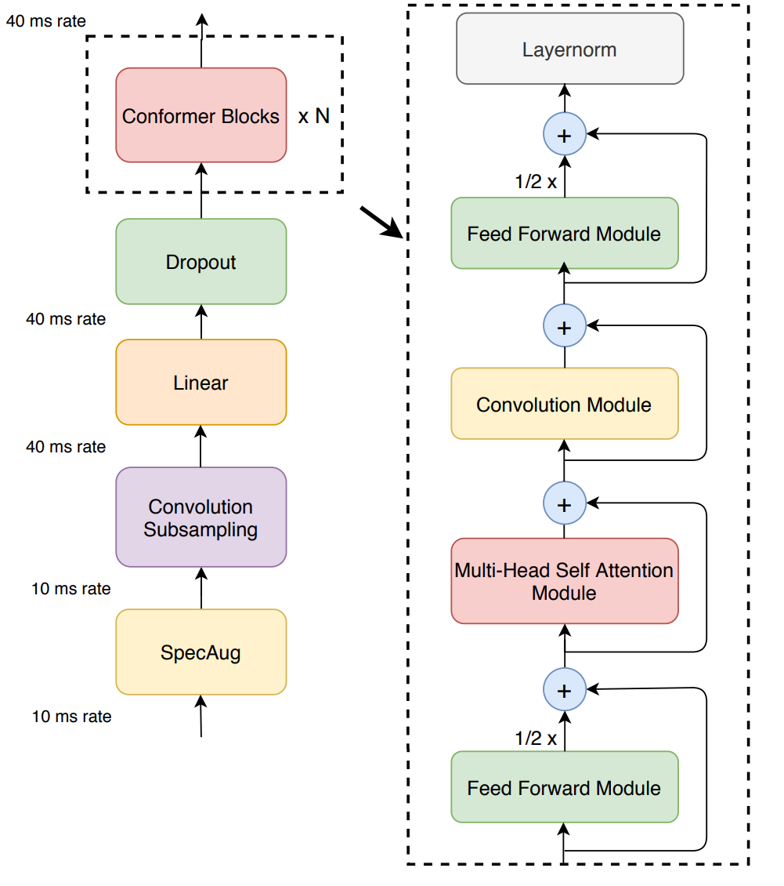

# ASR-Squad

 we describe the essential steps for training an ASR model for Egyptian Dialects. Namely:

- Data preprocessing
- Building tokenizers
- Training from scratch
- Inference and evaluation

## Resampling and Creating Manifests

To be able to use a dataset with the NeMo Toolkit, we first need to convert .csv files to .json manifests.

### Convert .csv Files to .json Manifests

```bash
python convert_csv_json.py \
    input_csv='train.csv' \
    audio_folder='train' \
    output_json='train.json'
```

### Data Cleaning

This document provides details on the preprocessing script used in the ASR Arabic project. The script processes Arabic text data by cleaning and normalizing it to prepare it for tokenization and model training.

#### Script Description

The script performs the following operations:

1. **Remove Special Characters**: It removes all punctuation and special characters except Arabic characters and spaces.
2. **Replace Diacritics**: It replaces various forms of Arabic diacritics with their base characters.
3. **Remove Out-of-Vocabulary Characters**: It removes any characters that are not Arabic characters or spaces.

### Functions

#### `write_processed_manifest(data, original_path, output_dir="/kaggle/working/")`

- **Purpose**: Writes the processed manifest data to a new file.
- **Arguments**:
  - `data` (list): List of processed manifest data.
  - `original_path` (str): The original file path of the manifest.
  - `output_dir` (str): Directory to save the processed manifest. Default is `/kaggle/working/`.
- **Returns**: Path to the new processed manifest file.

#### `get_charset(manifest_data)`

- **Purpose**: Calculates the character set from the manifest data.
- **Arguments**:
  - `manifest_data` (list): List of manifest data.
- **Returns**: Character set with counts as a `defaultdict`.

#### `remove_special_characters(data)`

- **Purpose**: Removes special characters from the text, keeping only Arabic characters and spaces.
- **Arguments**:
  - `data` (dict): Dictionary containing text data.
- **Returns**: Updated dictionary with cleaned text.

#### `replace_diacritics(data)`

- **Purpose**: Replaces Arabic diacritics with their base characters.
- **Arguments**:
  - `data` (dict): Dictionary containing text data.
- **Returns**: Updated dictionary with replaced diacritics.

#### `remove_oov_characters(data)`

- **Purpose**: Removes out-of-vocabulary characters, keeping only Arabic characters and spaces.
- **Arguments**:
  - `data` (dict): Dictionary containing text data.
- **Returns**: Updated dictionary with removed out-of-vocabulary characters.

#### `apply_preprocessors(manifest, preprocessors)`

- **Purpose**: Applies a list of preprocessing functions to the manifest data.
- **Arguments**:
  - `manifest` (list): List of manifest data.
  - `preprocessors` (list): List of preprocessing functions to apply.
- **Returns**: Processed manifest data.

To run the data cleaning script:

```bash
python Data_preprocessing.py
```

## Building Tokenizers

We used the NVIDIA NeMo Framework to build our tokenizer and train our model.

Subword tokenization is essential for ASR tasks because it offers several advantages over traditional word-based tokenization.

### Build Tokenizer with NVIDIA NeMo

```bash
python /kaggle/working/process_asr_text_tokenizer.py \
--manifest="/kaggle/input/dataset-ja/train.json" \
--data_root="/kaggle/working/tokenizers" \
--vocab_size=64 \
--tokenizer="spe" \
--spe_type="unigram"
```

## Training from Scratch

We used the architecture of the Conformer-CTC. Conformer-CTC is a CTC-based variant of the Conformer model. It uses CTC loss and decoding instead of RNNT/Transducer loss, making it a non-autoregressive model. The model combines self-attention and convolution modules for efficient learning.

### Model Architecture



### Config File for Model Parameters

[config file ](https://github.com/Alkholy53/ASR-Squad/blob/main/Training/conformer_ctc_bpe.yaml)

### Train the Model

```bash
python /kaggle/working/speech_to_text_ctc_bpe.py
```

## Inference and Evaluation

### Transcribe Speech

```bash
python /kaggle/working/transcribe_speech.py \
  model_path="/kaggle/working/ASR_squad.nemo" \
  dataset_manifest="/kaggle/input/dataset-ja/test.json"
```

### Calculate WER

```bash
python /kaggle/working/configs/speech_to_text_eval.py \
  dataset_manifest="/kaggle/working/test_with_predictions.json" \
  use_cer=False \
  only_score_manifest=True
```

### Calculate CER

```bash
python /kaggle/working/configs/speech_to_text_eval.py \
  dataset_manifest="/kaggle/working/test_with_predictions.json" \
  use_cer=True \
  only_score_manifest=True
```

### Generate a Submission File

```bash
python /kaggle/working/evaluation.py
```

---
